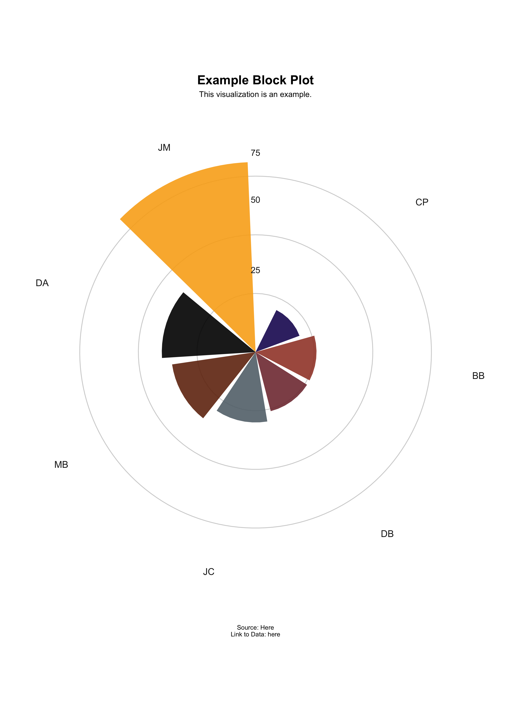

<!-- README.md is generated from README.Rmd. Please edit that file -->

# NBAcharts

<!-- badges: start -->
<!-- badges: end -->

The goal of NBAcharts is to create quick charts of NBA data.

## Installation

You can install the development version of NBAcharts from
[GitHub](https://github.com/) with:

``` r
# install.packages("devtools")
devtools::install_github("rbolt13/NBAcharts")
```

## Example

This is a basic example which shows you how to solve a common problem:

``` r
library(NBAcharts)
## basic example code
Player_data <- data.frame(player = c("DA", "CP3", "CJ", "DB", "MB","CP"),
                           data = c(978, 942, 797, 1789, 1135, 613))
plot <- circ_col_chart(player_data = Player_data,
                       ring_scale = 500, 
                       ring_inner = 600,
                       ring_middle = 1100,
                       ring_outer = 1600,
                       ringlab_inner = "500",
                       ringlab_middle = "1000",
                       ringlab_outer = "1500",
                       col_pal = c("#1D1160", "#813840", "#63727A", "#723010", "#000000", "#F9AD1B"),
                       chart_title = c("Example Plot"),
                       chart_subtitle = c("This visualization is an example."),
                       chart_source = c("\n\n Source: Here \nLink to Data: here"),
                       cc_chart_filename = c("example_plot.png"))
plot
```



# Sources

[R Packages](https://r-pkgs.org/index.html)

[Circular barplot with R and
ggplot2](https://r-graph-gallery.com/web-circular-barplot-with-R-and-ggplot2.html)

# Added Links

[How can I handle R CMD check “no visible binding for global variable”
notes when my ggplot2 syntax is
sensible?](https://stackoverflow.com/questions/9439256/how-can-i-handle-r-cmd-check-no-visible-binding-for-global-variable-notes-when)
